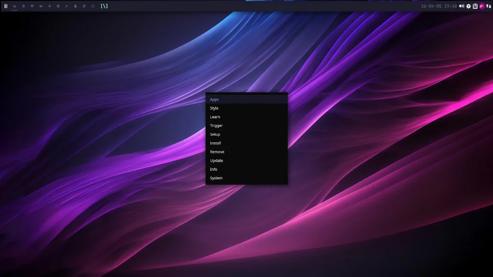
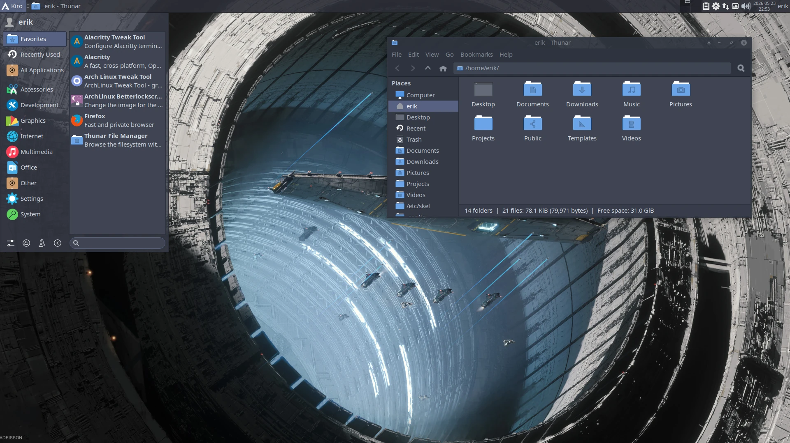
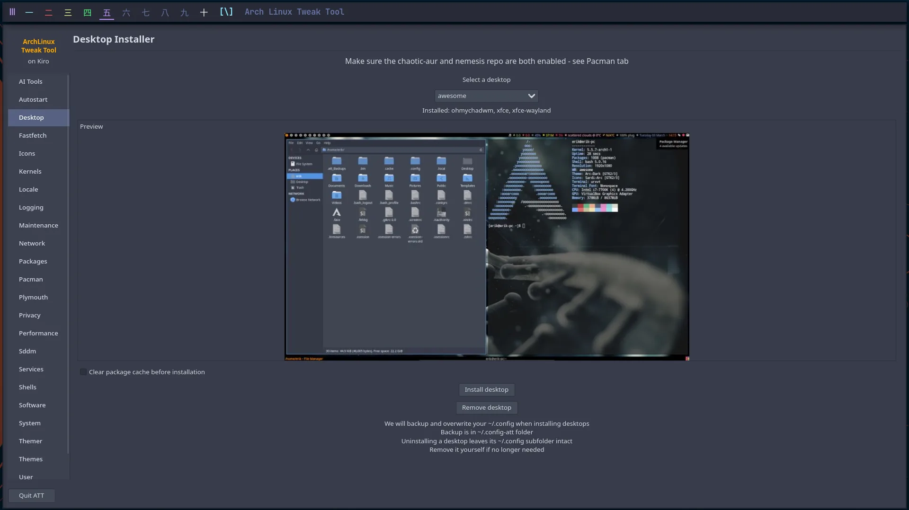
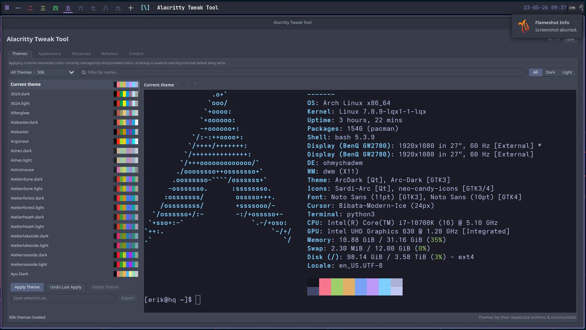
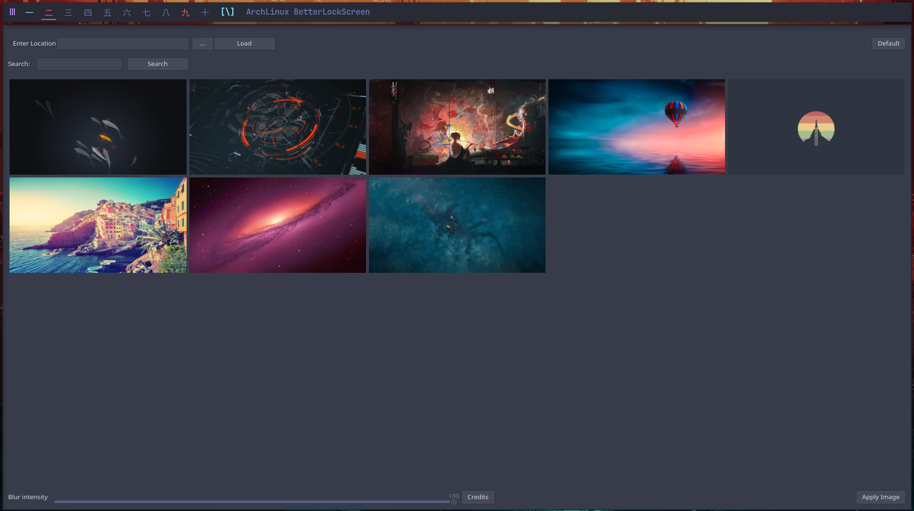
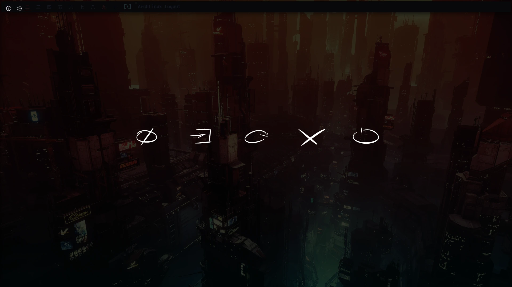

<p align="center">
  
</p>

# NEMESIS REPOSITORY

A pacman package repository for Kiro and Arch-based systems. It holds the
extra software you install **after** a clean install — the desktop apps,
themes, and tools (Spotify and friends) that aren't part of the base system.

Learn, have fun and enjoy.

> **Note** — this is *not* the install-time repo. The `kiro_repo` is used by the
> Calamares installer while building the system and disappears after reboot.
> The nemesis repo is the one you opt into and keep, to pull in extras whenever
> you like.

## Screenshots

<table>
  <tr>
    <td align="center">
      <br />
      <sub>ohmychadwm desktop</sub>
    </td>
    <td align="center">
      <br />
      <sub>XFCE desktop</sub>
    </td>
  </tr>
  <tr>
    <td align="center">
      <br />
      <sub>Arch Linux Tweak Tool</sub>
    </td>
    <td align="center">
      <br />
      <sub>Alacritty tweak tool</sub>
    </td>
  </tr>
  <tr>
    <td align="center">
      <br />
      <sub>Betterlockscreen</sub>
    </td>
    <td align="center">
      <br />
      <sub>Logout screen</sub>
    </td>
  </tr>
</table>

## Add the repository

Add this to your `/etc/pacman.conf` with npacman or the ATT:

```
[nemesis_repo]
SigLevel = Never
Server = https://erikdubois.github.io/$repo/$arch
```

Or download and run the script:

```
curl -sL bit.ly/nemesis-repo | sudo bash
```

## Watch this video

[](https://youtu.be/ocKZIzAb7GQ)

# Websites

Information : https://kiroproject.be

# Social Media

Youtube : https://www.youtube.com/erikdubois
