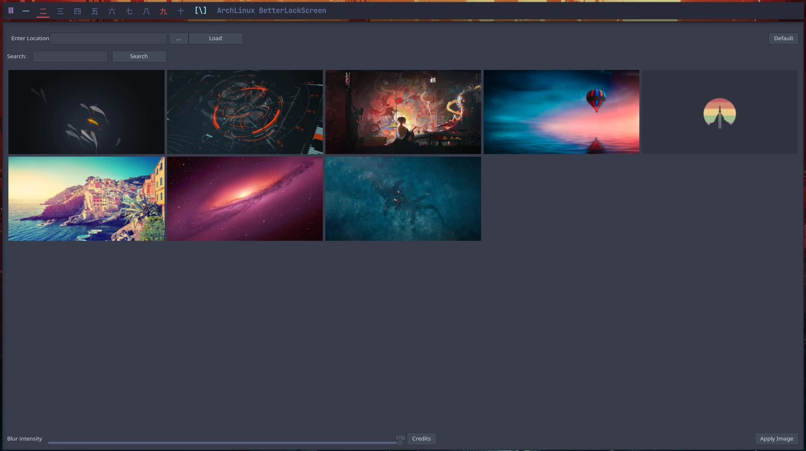

<p align="center">
  
</p>

# NEMESIS REPOSITORY

A pacman package repository for Kiro and Arch-based systems. It holds the
extra software you install **after** a clean install — the desktop apps,
themes, and tools (Spotify and friends) that aren't part of the base system.

Learn, have fun and enjoy.

> **Note** — this is *not* the install-time repo. The `kiro_repo` is used by the
> Calamares installer while building the system and disappears after reboot.
> The nemesis repo is the one you opt into and keep, to pull in extras whenever
> you like.

## Screenshots

<table>
  <tr>
    <td align="center">
      <br />
      <sub>ohmychadwm desktop</sub>
    </td>
    <td align="center">
      <br />
      <sub>XFCE desktop</sub>
    </td>
  </tr>
  <tr>
    <td align="center">
      <br />
      <sub>Arch Linux Tweak Tool</sub>
    </td>
    <td align="center">
      <br />
      <sub>Alacritty tweak tool</sub>
    </td>
  </tr>
  <tr>
    <td align="center">
      <br />
      <sub>Betterlockscreen</sub>
    </td>
    <td align="center">
      <br />
      <sub>Logout screen</sub>
    </td>
  </tr>
</table>

## Add the repository

`nemesis_repo` is PGP-signed by the Kiro key (trusted via `kiro-keyring`) and
inherits your global `SigLevel = Required`. The easiest way to add it is the
helper script — it trusts the key, installs `kiro-keyring` + `kiro-mirrorlist`,
and adds the repo (backing up your current `/etc/pacman.conf` first):

```
curl -sL bit.ly/nemesis-repo | sudo bash
```

Once set up, your `/etc/pacman.conf` holds the repo via the mirrorlist shipped
by `kiro-mirrorlist`:

```
[nemesis_repo]
Include = /etc/pacman.d/kiro-mirrorlist
```

`npacman` and the Arch Linux Tweak Tool can add the repo for you too.

Prefer to do it by hand? The mirrorlist file doesn't exist until
`kiro-mirrorlist` is installed, so bootstrap with a direct `Server` line first,
then trust the key and install the packages:

```
# add to /etc/pacman.conf
[nemesis_repo]
Server = https://erikdubois.github.io/$repo/$arch
```

```
sudo pacman -Sy
sudo pacman-key --recv-keys 149ABD0C3A0563EE --keyserver keyserver.ubuntu.com
sudo pacman-key --lsign-key 149ABD0C3A0563EE
sudo pacman -Sy --needed kiro-keyring kiro-mirrorlist
```

You can then swap the `Server` line for `Include = /etc/pacman.d/kiro-mirrorlist`.

### Signing key

Packages are signed with the **Kiro Signing Key**:

```
Kiro Signing Key <erik.dubois@gmail.com>
Fingerprint: D965 8D54 6AD4 8015 CABC  612B 149A BD0C 3A05 63EE
```

Import it from a keyserver to verify signatures manually:

```
gpg --keyserver keyserver.ubuntu.com --recv-keys 149ABD0C3A0563EE
# or
gpg --keyserver keys.openpgp.org --recv-keys 149ABD0C3A0563EE
```

## Watch this video to add the nemesis-repo 

[](https://youtu.be/ocKZIzAb7GQ)

# Websites

Information : https://kiroproject.be

# Social Media

Youtube : https://www.youtube.com/erikdubois

<!-- KIRO-FUNDING-FOOTER:START — managed by Kiro-HQ/cascade-readme-footer.sh -->
## Help fund Kiro

Everything I build here stays free and open — always. If Kiro or any of these
tools have ever saved you time or taught you something, a small monthly
contribution helps keep the work going. Donations target break-even, nothing
more — the core always stays free for everyone.

- GitHub Sponsors: https://github.com/sponsors/erikdubois
- Patreon: https://www.patreon.com/c/kiroproject
- YouTube memberships: https://www.youtube.com/@ErikDubois/join
- Ko-fi: https://ko-fi.com/erikdubois
- PayPal: https://www.paypal.me/erikdubois
<!-- KIRO-FUNDING-FOOTER:END -->
